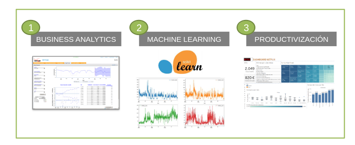
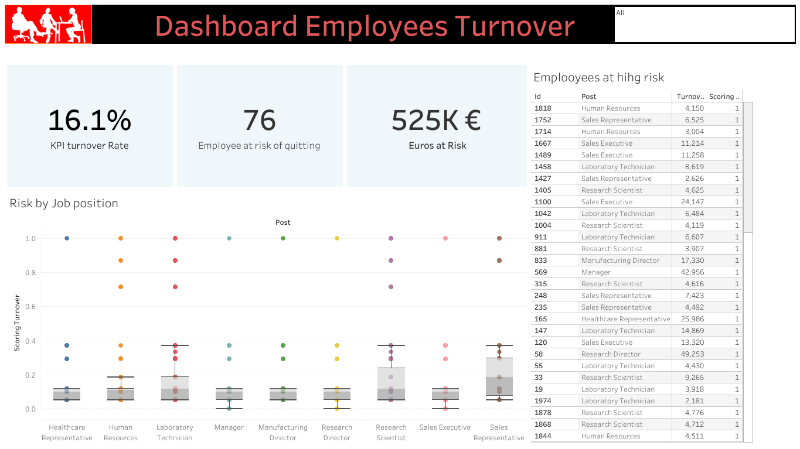

#  ✨Calculation of employee turnover costs✨

Employee turnover costs calculation is the process of determining the financial impact of employee turnover on a business. It includes both direct and indirect costs, such as:

- **Direct costs**:
  - Recruiting and hiring costs (e.g., advertising, job boards, recruiter fees)
  - Onboarding and training costs
  - Severance pay and unused vacation time
- **Indirect costs:**
  - Lost productivity
  - Decreased morale
  - Disruption to workflow
  - Customer dissatisfaction

The cost of employee turnover can vary widely depending on the industry, the employee's role, and the reason for leaving. However, it is generally estimated to cost between 50% and 200% of the employee's annual salary to replace them.

To calculate the cost of employee turnover, businesses can use the following formula:

Cost of employee turnover = (Number of employees who left / Total number of employees) * Average cost per employee turnover

The average cost per employee turnover can be calculated by adding up the direct and indirect costs associated with employee turnover and dividing by the number of employees who left.

Once businesses have calculated the cost of employee turnover, they can use this information to develop strategies to reduce turnover and improve employee retention.

By reducing employee turnover, businesses can save money and improve their bottom line.
### Project Steps

### [See Project Code](TPS_Dia_1_Configuracion.ipynb)

### [See Dashboard in Tableau](https://public.tableau.com/shared/P6PGN3KPC?:display_count=n&:origin=viz_share_link )

 
